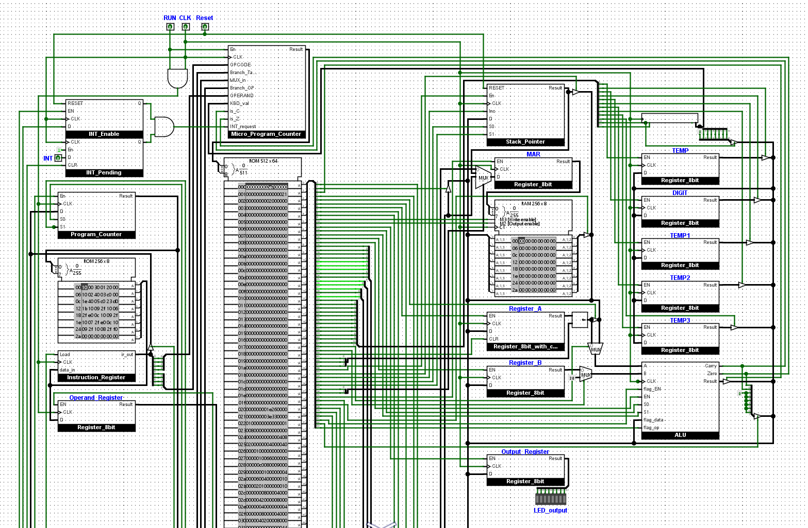

# 8-Bit Microcoded CPU

A custom-designed 8-bit CPU originally built in Logisim and now being reconstructed in Verilog, with a Python assembler, microcoded control flow, stack-based subroutines, and opcode-selectable I/O behavior.

This project explores the internal architecture of a simple processor and demonstrates how behaviors such as keyboard input routines, subroutine calls, interrupt handling, and assembler-driven program loading can be implemented through microcode sequencing and hardware-description design.

## Table of Contents

- [Table of Contents](#table-of-contents)
- [Overview](#overview)
- [Architecture](#architecture)
- [CPU Block Diagram](#cpu-block-diagram)
- [Instruction Format](#instruction-format)
- [Instruction Set](#instruction-set)
- [Stack Architecture](#stack-architecture)
- [Interrupt Architecture](#interrupt-architecture)
- [Execution Model](#execution-model)
- [Keyboard Input Routine](#keyboard-input-routine)
- [I/O Addressing Model](#io-addressing-model)
- [Special I/O Instructions](#special-io-instructions)
- [Example Program](#example-program)
- [Assembler](#assembler)
- [Verilog / ModelSim Implementation](#verilog--modelsim-implementation)
- [Design Philosophy](#design-philosophy)
- [Project Roadmap](#project-roadmap)

---

## Overview

This CPU implements a multi-cycle microcoded architecture designed to prioritize clarity, correctness, and extensibility rather than raw performance.

The processor was originally designed in Logisim as a visual CPU architecture. The project has since been extended into a Verilog implementation, where the same CPU concepts are recreated as hardware-description modules and tested through ModelSim simulation.

The processor executes instructions across multiple clock cycles using a shared data bus and a microprogrammed control unit. Each instruction is broken into smaller micro-operations stored in microcode ROM.

Key architectural ideas explored in this project include:

- Microcoded control units
- Stack-based subroutine calls
- Interrupt entry/return
- Opcode-selectable I/O and device access
- Conditional branching
- Shared-bus architectures
- Multi-cycle instruction execution
- Verilog hardware-description design
- Testbench-based simulation and debugging
- Assembler-to-ROM program loading

---

## Architecture

Core datapath and control components:

- 8-bit accumulator-based datapath
- Program Counter, Instruction Register, Stack Pointer, and flag register
- Shared internal bus
- Microcode ROM control sequencing
- RAM with microcode-defined I/O/device access paths

Related documentation:

- `docs/architecture_report.md`
- `docs/isa.md`
- `docs/stack_microarchitecture.md`
- `docs/interrupt_architecture.md`

---

## CPU Block Diagram

Top-level CPU layout from the Logisim implementation:



---

## Instruction Format

Instructions are composed of either 1 byte or 2 bytes. The CPU automatically performs an additional fetch cycle when an instruction requires an operand.

### Single-Byte Instruction

These instructions contain a primary opcode and may use the lower 4 bits as a sub-op selector for instruction variants.

```
[ OPCODE (4 bits) ][ SUB-OP / MODE (4 bits) ]

 7   6   5   4   3   2   1   0
OP3 OP2 OP1 OP0 S3  S2  S1  S0
```

Used by: `NOP`, `HLT`, `PUSH`, `POP`, `RET`, `IRET`, `EI`, `LDK`, `OUT`

### Two-Byte Instruction

Instructions that reference memory or program addresses use a second byte for a full 8-bit operand.

```
Byte 1: [ OPCODE (4 bits) ][ SUB-OP / MODE (4 bits) ]
Byte 2: [ OPERAND (8 bits) ]

Byte 1:  7   6   5   4   3   2   1   0
        OP3 OP2 OP1 OP0 S3  S2  S1  S0

Byte 2:  7   6   5   4   3   2   1   0
         A7  A6  A5  A4  A3  A2  A1  A0
```

Used by: `LDA`, `STA`, `ADD`, `SUB`, `CALL`, `JMP`, `JZ`, `JC`

---

## Instruction Set

| Opcode | Instruction | Description |
|--------|-------------|-------------|
| 0000   | (reserved)  | Internal microcode entry (interrupt check / fetch / decode) |
| 0001   | LDA addr    | A <- RAM[addr] |
| 0010   | STA addr    | RAM[addr] <- A |
| 0011   | ADD addr    | A <- A + RAM[addr] |
| 0100   | SUB addr    | A <- A - RAM[addr] |
| 0101   | PUSH        | Push Register A onto stack |
| 0110   | POP         | Pop stack value into Register A |
| 0111   | CALL addr   | Push PC to stack and jump to addr |
| 1000   | RET         | Pop return address from stack into PC |
| 1001   | NOP         | No operation |
| 1010   | IRET        | Return from interrupt |
| 1011   | EI          | Enable interrupts |
| 1100   | JZ addr     | Jump if Zero flag = 1 |
| 1101   | JC addr     | Jump if Carry flag = 1 |
| 1110   | JMP addr    | Unconditional jump |
| 1111   | HLT         | Halt CPU |

Special one-byte encodings:

- `LDK` = `0x1E`
- `OUT` = `0x2F`

---

## Stack Architecture

The stack grows downward in RAM and is managed by the Stack Pointer (`SP`).

Push behavior:

```
SP <- SP - 1
RAM[SP] <- value
```

Pop behavior:

```
value <- RAM[SP]
SP <- SP + 1
```

`CALL` and `RET` use this same mechanism for return-address storage.

---

## Interrupt Architecture

Interrupts are checked after each completed instruction.

When an interrupt is accepted:

1. Push current `PC` to stack
2. Disable interrupts
3. Jump to fixed interrupt vector `0xF0`

`IRET` restores `PC` from stack and re-enables interrupts.

---

## Execution Model

Conceptual instruction cycle:

```
FETCH -> DECODE -> EXECUTE -> CHECK_INTERRUPT -> FETCH
```

No pipelining is used. Instructions complete before the next instruction begins.

---

## Keyboard Input Routine

Keyboard input can be reached through the `LDA` family path (including legacy-compatible `LDA 14` behavior in current microcode).

A keyboard-read variant activates a microcoded routine that reads a multi-digit decimal number.

The routine accepts ASCII digits `0-9`, accumulates them as a decimal number, and terminates on Enter (`0x0D`) or invalid input. The final value is stored in Register `A`.

Algorithm:

```
A <- 0

loop:
    read keyboard
    if not digit -> exit

    digit <- ascii - 48
    A <- A * 10 + digit
    repeat
```

---

## I/O Addressing Model

With double-fetch instruction flow, the first fetch byte can use bits `0-3` as a sub-op selector inside an opcode family.

This allows instruction variants such as `LDK`, `LDA_CHAR`, or `OUT` to be selected by the first byte while keeping the second fetch byte fully available as an 8-bit operand when needed.

Current practical model:

- `LDA` family variants are selected by low-nibble sub-op bits in fetch byte 1
- `STA` family variants are selected by low-nibble sub-op bits in fetch byte 1
- fetch byte 2 remains a full operand byte for address/immediate use

Legacy memory-mapped addresses (for microcode compatibility):

| Address | Purpose |
|---------|---------|
| 14      | Keyboard input path (legacy-compatible) |
| 15      | Output register path (legacy-compatible) |

---

## Special I/O Instructions

The CPU provides dedicated I/O instruction variants (selected through opcode sub-op bits):

```
LDA_CHAR ; Read one keyboard character (ASCII) into A
LDK      ; Read decimal input from keyboard into A
OUT      ; Write A to output register
```

These variants are selected in fetch byte 1. Current documented encodings include `LDA_CHAR = 0x1D`, `LDK = 0x1E`, and `OUT = 0x2F`.

---

## Example Program

### Infinite Loop

```
start:
    LDA 0
    ADD 1
    STA 2
    JMP start
```

### Machine Code

```
00010000 00000000
00110000 00000001
00100000 00000010
11100000 00000000
```

---

## Assembler

Assembly programs are converted into machine code using the Python assembler.

Run with:

```
python assembler.py program.asm
```

Features:

- Label resolution
- Opcode encoding
- Decimal/hex/binary operand parsing
- Special I/O variant support (`LDK`, `OUT`)
- Hex byte output generation

The assembler now generates a `program.mem` file that can be loaded directly by the Verilog `program_rom.v` module. This allows assembled programs to be tested in the Verilog CPU simulation without manually writing each machine-code byte into the testbench.

Conceptual flow:

```
program.asm -> assembler.py -> program.mem -> program_rom.v -> Verilog CPU simulation
```

---

## Verilog / ModelSim Implementation

In addition to the original Logisim design, this project now includes an active Verilog reconstruction of the CPU.

The Verilog version rebuilds the CPU as hardware-description modules and verifies behavior through ModelSim testbenches and waveform analysis.

Completed Verilog / simulation work includes:

- Basic Verilog module setup
- Register, PC, SP, ALU, RAM, and program ROM modules
- Shared-bus behavior using mux-based routing
- Datapath reconstruction
- Microcode ROM representation
- Microprogram counter and decode sequencing
- Control-signal integration
- Interrupt enable and interrupt pending logic
- Top-level CPU integration
- Program loading through assembler-generated `program.mem`
- Simulation of real instruction execution
- Debugging of timing, sequencing, and edge-case behavior through Day 28 of the Phase 1 guide

The current Verilog implementation is being prepared for FPGA deployment, so the Logisim version remains the original visual architecture reference while the HDL version represents the next implementation stage.

---

## Design Philosophy

This CPU emphasizes:

- Clarity over performance
- Microcode-driven behavior
- Minimal hardware duplication

By avoiding pipelining and executing one instruction at a time, the architecture remains easier to reason about and debug.

The project intentionally starts with a visual CPU design before moving into Verilog. This makes it easier to understand the architecture first, then rebuild the same ideas in a form that can be simulated, synthesized, and eventually run on FPGA hardware.

---

## Project Roadmap

Current status: **Phase 0 completed** and **Phase 1 completed**.

Phase 0 includes microcoded control, memory-mapped I/O, opcode-selectable I/O behavior, branching, assembler support, stack support, interrupt support, and expanded RAM.

Phase 1 progressed through Verilog foundations, module bring-up, simulation setup, datapath reconstruction, control-unit integration, assembler-to-ROM program loading, interrupt-focused simulation, debugging/edge-case cleanup, and culminated in successful synthesis and deployment to physical FPGA hardware.

Planned direction for future work:

- **Phase 2:** Pipelined RISC redesign (Active focus)
- **Phase 3:** Memory hierarchy / cache experiments
- **Phase 4:** Hardware accelerator exploration

### Phase 1 Technical Milestones (Verilog / ModelSim / FPGA Validation)

Key achievements from the completed HDL track include:

- Foundations, module bring-up, simulation setup, datapath reconstruction, and control-unit integration were successfully developed and tested.
- The Python assembler outputs `program.mem`, which is loaded directly by `program_rom.v` for Verilog CPU simulation and Vivado Block RAM initialization.
- Real instruction execution, interrupt behavior, and major timing/sequencing issues have been thoroughly tested and debugged.
- The FPGA implementation milestone was reached: the design was synthesized via Xilinx Vivado and successfully deployed to a Basys 3 FPGA, verifying bare-metal assembly execution and physical I/O interaction.

This repository remains the canonical record for the Logisim-first architecture and assembler, while the HDL reconstruction artifacts continue to be expanded and documented incrementally.
